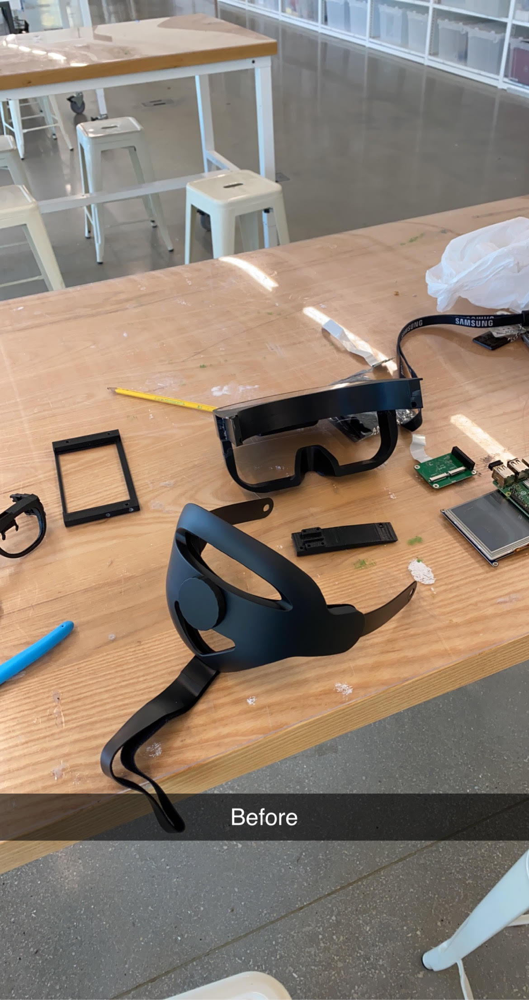
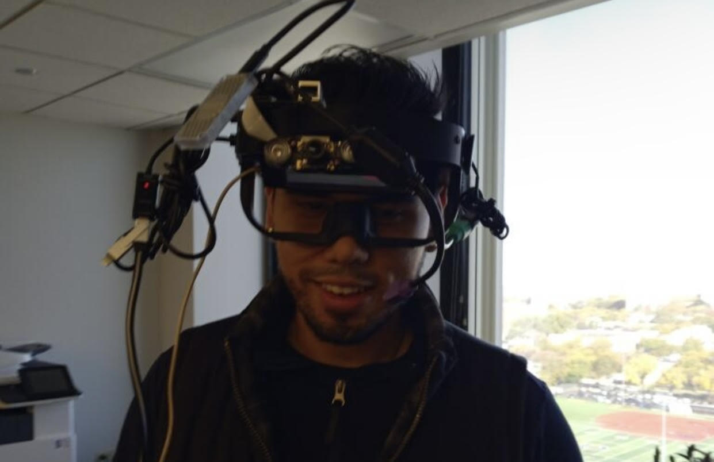
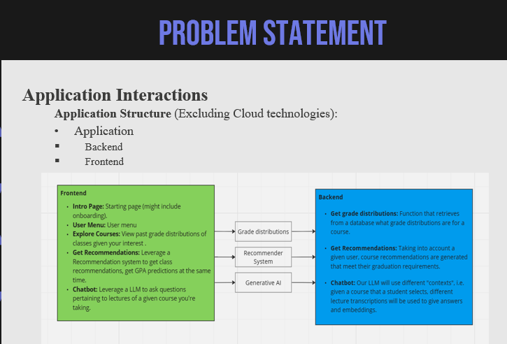
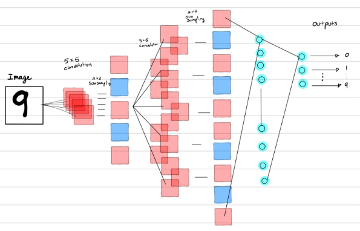
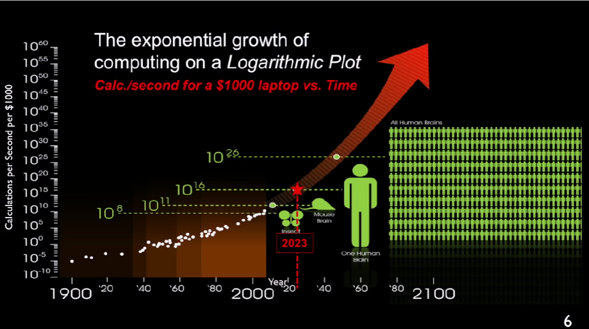
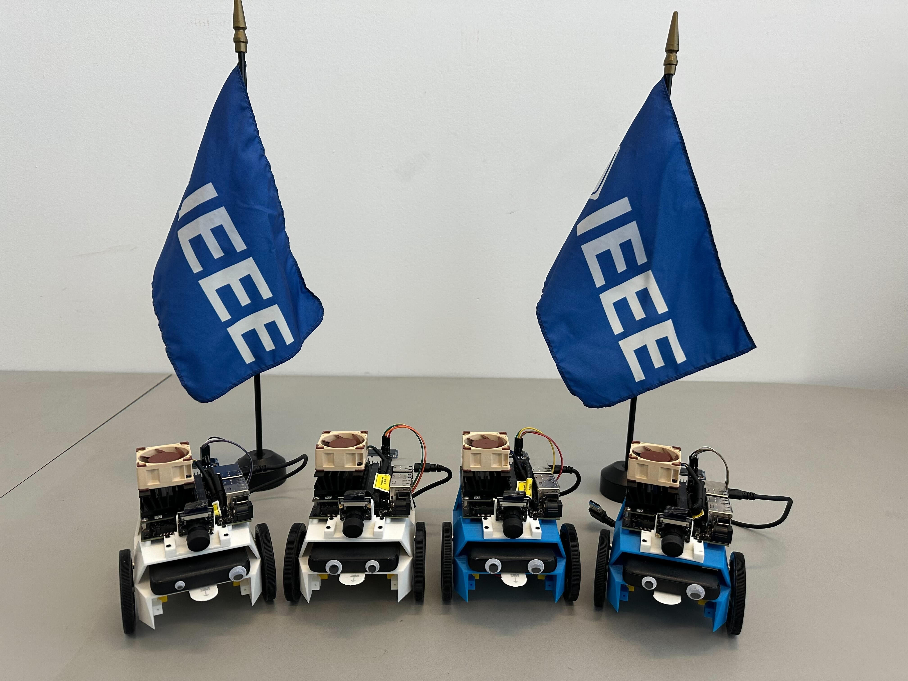
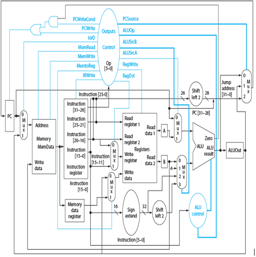

# HELLO

## My name is Sal Jimenez and I am a Computer Engineering undergrad, DreamUS Scholar, SHPE & IEEE Member, and an Ambitious Learner.

## My background is centered around where Hardware and Software intertwine. Operating Systems, Machine Learning, and Computer architecture are what really interest me.

## Some of my past and current projects are:

- **3D printed Augmented Reality Headset**
   I helped in spearheading the design, research, integration, testing and troubleshooting for this project. I led a team of software and electrical engineers to construct an AR headset capable of object detection for helping elderly in assisted driving. We placed 4th our of 40 teams for this engineering hackathon. (Thank you IIT & Grainger for this opportunity!)

- **GradPath AI (Recommender System/Chatbot for classes)**
  Developed an AI-driven recommendation system, leveraging course grade data and historical student records, to tackle uninformed course choices and improve graduation rates. Personalized course recommendations were generated, enhancing efficiency, and aligning with each student's goals.
	Incorporating two data frames, GRADPATH AI applies classification Machine Learning techniques to forecast student letter grades, a categorical variable, through predictive modeling. Approach involves presenting input data to a machine learning model to determine corresponding categories, defining a key aspect of classification machine learning.
Ill provide a youtube video link of this project right here: [GradPath AI](https://www.youtube.com/watch?v=6CZVAXxrdJU&t=3s)

- **Convolution Neural Network**
  Built out a Convolution Neural Network from complete scratch in JAVA. No neural network libraries where utilized, only Math and ArrayLists :).
  Used the MNIST training & Testing data set for testing. **(I got it to reach about %91 accuracy on the guesses)**

## My background:
- **I'm passionate about the industry _trends_ going on in the world of engineering.**

  
- My educational background is a Bachelors of Science in Computer Engineering at Illinois Institute of Technology in the Windy City. Im also a humble Morton College Alumni (MC STATE!!!) 
  
- Former CEO/Consultant of Polarizer Video Studios:
      Created video ads for dental and local businesses. Outsources services to 3d party vendors to meet client demands. Onboarded clients onto our platforms.
  
- FormerIIT-IEEE Social Media Exec Board: Here is our instagram: [IIT-IEEE](https://www.instagram.com/iit.ieee/)

Outside of science, Im very passionate in the sweet science (boxing), not only that I also am heavily investing in leading both by example and guiding my younger brother, Aaron, LinkedIn: through his undergrad journey since he too is also looking to study computer science / electrical engineering. I am also and avid reader and am heavily investing in my SHPE chapter at my school. 

Maybe insert photo here. 

## Hackathons Ive Participated in:

### Real-Time Communications Hackathon. Sponsored by [IEEE](https://www.ieee.org/)
- The RTC Conference at IIT is a globally recognized collaborative event where the interactive multimedia and real-time communications industries and academia connect. The conference  brings together developers, technical professional and business executives from industry, standards, policy, regulatory, and research, promoting an open exchange of ideas to lead future development in the rapidly changing field of real-time communications.

 Here is a link to the description: [RTC HACK](https://events.vtools.ieee.org/m/348711)
 We placed **2nd out of 15 teams**. We helped build out a website that integrated two different companies API's: 
 LiveKit API DOC can be found [here](https://docs.livekit.io/realtime/) and InDigital [here](https://indigital.net/)
 
 End project was a tutor like service where students can connect with tutors and peers in Real Time, and also use our built in AI chatbot to ask questions regarding subject matters. LinkedIn Post about the event [here](https://www.linkedin.com/feed/update/urn:li:activity:7114670066301890560/)

### SHPE 2023 CyberSecurity Challenge. Sponsored by [NSA](https://www.nsa.gov/), [Raytheon](https://www.rtx.com/), [Abbott](https://www.abbott.com/), & [Rockwell Automation](https://www.rockwellautomation.com/en-us.html)
 - This hackathon was hosted by the SHPE 2023 National Convention in Salt Lake City, UTAH.
We were placed in a random team with 4 others, our goal was to solve sets of cybersecurity challenges -all worth differing amount of points depending on its difficutly. This covered topics such as SQL injections, Stack-Overflow, Systems Programming, Operational Security, Administrative Security, Digital Forensics & more. Our team place **8th out of 40** cant win em' all you know. :(. This one had some tough competition.

 Photo here somewhere

## Here are more detailed explainations and links to some of the projects

### Neural Networks

CNN, RNN are in repo

### Stock Trading Neural Net Bot

coming soon

### 32 bit RISC Processor CPU

In git repo

### Finite state machine project

coming soon

### My first ever embedded system project: 3d printed Static Lie Detector

oh gawd

### Object Oriented Programming Projects

This is a series of labs and projects completed in my intro to CS classes

### Data Structures and Algorithms

Its always good to review the fundamentals haha

### Trends: The engineering landscape and market outlook for the coming decade

The future is faster than you think by Peter Diamandis

### Contact & LinkedIn

Feel free to reach out to me at <sal.hndrx@gmail.com>

You can find my LinkedIn [Here](https://www.linkedin.com/in/sjimenez2501/)
