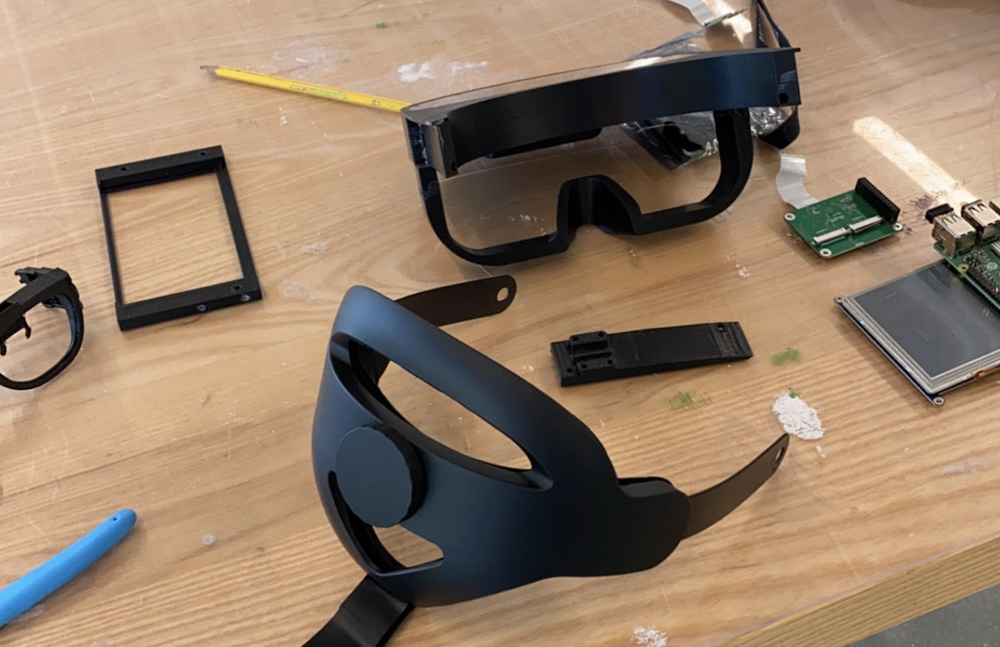
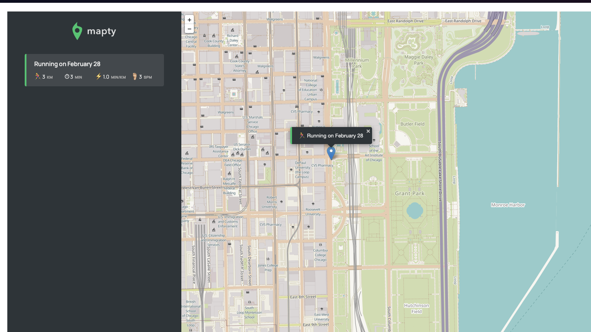
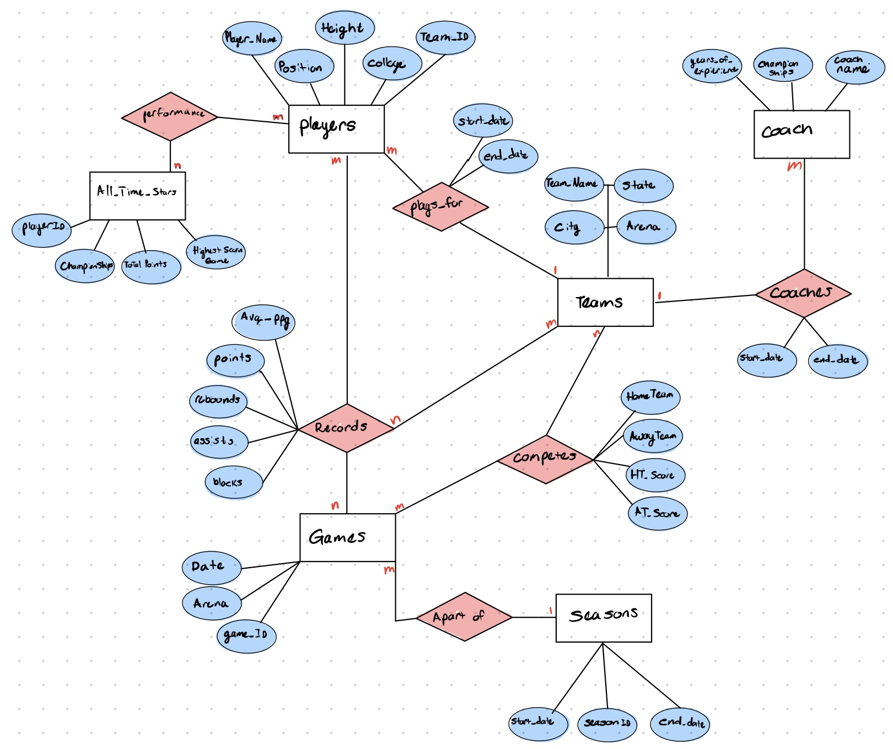
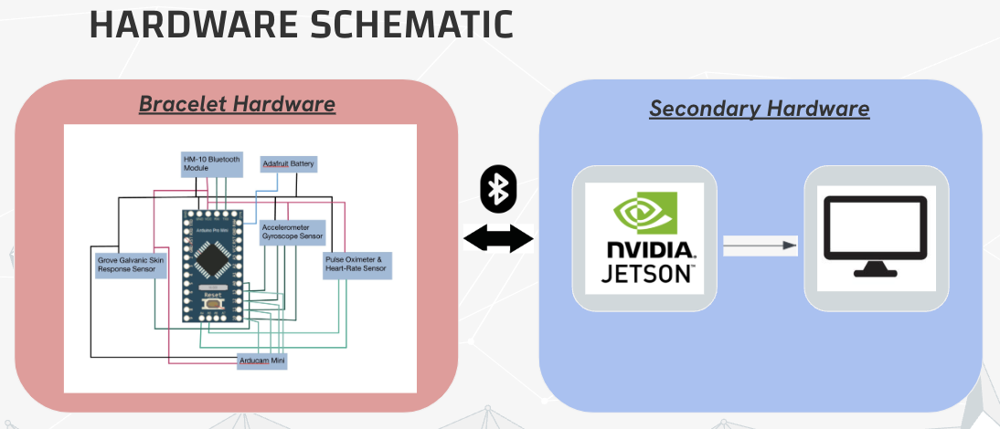
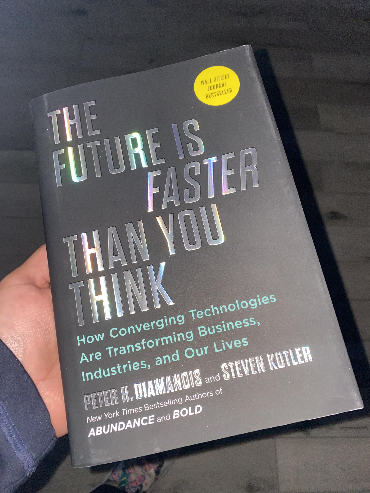

# HELLO

## My name is Sal Jimenez and I am a Computer Engineering undergrad, DreamUS Scholar, SHPE & IEEE Member, and an Ambitious Learner.
 

## My expertise lies at the dynamic intersection of Hardware and Software realms, where I've navigated the intricate interplay between the two. As a Computer Engineer, I've delved deep into this vibrant ecosystem, harnessing its formidable potential to craft an impressive array of projects. From the sleek sophistication of frontend development to the seamless integration of backend systems, and from the intricate management of database systems. Not content with the confines of software alone, I've also ventured into the realm of hardware. Ive delved into the cutting-edge domain of transistor design (operating at the nanometer scale!), and I've embarked on ambitious endeavors such as the construction of a fully-functional MIPS computer architecture using VHDL, showcasing my ability to navigate both the digital and physical realms with equal dexterity and innovation.

## Some of my past and current projects are:

- **3D printed Augmented Reality Headset**
   I helped in spearheading the design, research, integration, testing and troubleshooting for this project. I led a team of software and electrical engineers to construct an AR headset capable of object detection for helping elderly in assisted driving. We placed 4th our of 40 teams for this engineering hackathon. (Thank you IIT & Grainger for this opportunity!)

- **GradPath AI (Recommender System/Chatbot for classes)**
  Developed an AI-driven recommendation system, leveraging course grade data and historical student records, to tackle uninformed course choices and improve graduation rates. Personalized course recommendations were generated, enhancing efficiency, and aligning with each student's goals.
	Incorporating two data frames, GRADPATH AI applies classification Machine Learning techniques to forecast student letter grades, a categorical variable, through predictive modeling. Approach involves presenting input data to a machine learning model to determine corresponding categories, defining a key aspect of classification machine learning.
Ill provide a youtube video link of this project right here: [GradPath AI](https://www.youtube.com/watch?v=6CZVAXxrdJU&t=3s)

_	_	_	_	_	_	_	_	_	_	_	_	_	_	_	_	_	_	_	_	_	_	_	_	_

- **Convolution Neural Network**
  Built out a Convolution Neural Network from complete scratch in JAVA. No neural network libraries where utilized, only Math and ArrayLists :).
  Used the MNIST training & Testing data set for testing. **(I got it to reach about 91% accuracy on the guesses)**

Click here for the full git [repo](https://github.com/ELECTRONICA-2501/Convolution_Neural_Network_Project)
_	_	_	_	_	_	_	_	_	_	_	_	_	_	_	_	_	_	_	_	_	_	_	_	_

- **Mapty(JavaScript app)**
  Here is a cool little project that you yourself can run on your local computer. Check out the readme file to see how to start running the project. Mapty is a workout application that allows a User to track their running or cycling workouts at their specific geolocation. Under the hood- this app makes use of 3rd party geolocation-based libraries that allow a developer to input specific scripts into the html file that will then allow you to play around with the functions within the library. In this app, I make use of the Leaflet JavaScript Libary (link here: https://leafletjs.com/download.html)
  Down below is a screenshot of me using this app, as well as the link to the [git repo](https://github.com/ELECTRONICA-2501/Geolocation_Workout_App/blob/main/README.md).
  
  _	_	_	_	_	_	_	_	_	_	_	_	_	_	_	_	_	_	_	_	_	_	_	_	_

- **NBA MOCK Database Project**
  This collaborative endeavor represents a group project derived from the Spring 2024 iteration of CS 425 Database, under the guidance of esteemed Professor Gerald Balekaki at Illinois Tech. Within this undertaking, I am intricately involved in every facet of its execution. This encompasses crafting the comprehensive Entity-Relationship Diagram, as illustrated below, and meticulously constructing the schema utilizing the sophisticated tools of MySQL Workbench. Additionally, I am spearheading the development of the user-friendly front-end interface, ensuring seamless interaction with the underlying data infrastructure. NOTE: This is an ongoing project, shall upload more results and progress incremently. So far this is some of our deliverables. 

_	_	_	_	_	_	_	_	_	_	_	_	_	_	_	_	_	_	_	_	_	_	_	_	_

- **Tailored Meditation Device**
  One of the most ambitions projects Ive endevoured to complete. This is a collaborative team project from the Spring 2024 iteration of the ECE 441 Smart & Embedded Systems course, under the guidance of Dr. Jafar Saniie who is also the Head of the ECE department at Illinois Tech. This Embedded System device uses a camera, heart-rate, perspiration, and temperature sensors to track dynamically changing biological rhythms in a users body. This data will then be analyzed and return a tailored meditation practice to its user based off the data collected. 
My role is the Software Lead. Tasked with building out the front & backend of this project.
This is an _Ongoing project_. Shall upload all documentation pertained to this project once course conlcludes. For the embedded systems fanatics, here is the hardware schematic as a preview! 
_	_	_	_	_	_	_	_	_	_	_	_	_	_	_	_	_	_	_	_	_	_	_	_	_

## My background:
- **I'm passionate about the industry _trends_ going on in the world of engineering.**

I Think its really important to continously pursue mastery in any worthwhile skills. In this case, Engineers who can reap value from increasingly complex machines will stand to win in the coming reshuffling that is the future. I think business, technology, culture, and economic incentives are great things to study. This book right here is my favorite book that draws a beautifly road map of the **possible** transformations new technology can bring to the industries that matter the most to our everyday lives.

 
  
- My educational background is a Bachelors of Science in Computer Engineering at Illinois Institute of Technology in the Windy City. Im also a humble Morton College Alumni (MC STATE!!!) 
  
- Former CEO/Consultant of Polarizer Video Studios:
      Created video ads for dental and local businesses. Outsources services to 3d party vendors to meet client demands. Onboarded clients onto our platforms.
  
- FormerIIT-IEEE Social Media Exec Board: Here is our instagram: [IIT-IEEE](https://www.instagram.com/iit.ieee/)

Outside of science, Im very passionate in the sweet science (boxing), not only that I also am heavily investing in leading both by example and guiding my younger brother, Aaron, LinkedIn: through his undergrad journey since he too is also looking to study computer science / electrical engineering. I am also and avid reader and am heavily investing in my SHPE chapter at my school. 

## Hackathons Ive Participated in:

### Real-Time Communications Hackathon. Sponsored by [IEEE](https://www.ieee.org/)
- The RTC Conference at IIT is a globally recognized collaborative event where the interactive multimedia and real-time communications industries and academia connect. The conference  brings together developers, technical professional and business executives from industry, standards, policy, regulatory, and research, promoting an open exchange of ideas to lead future development in the rapidly changing field of real-time communications.

 Here is a link to the description: [RTC HACK](https://events.vtools.ieee.org/m/348711)
 We placed **2nd out of 15 teams**. We helped build out a website that integrated two different companies API's: 
 LiveKit API DOC can be found [here](https://docs.livekit.io/realtime/) and InDigital [here](https://indigital.net/)
 
 End project was a tutor like service where students can connect with tutors and peers in Real Time, and also use our built in AI chatbot to ask questions regarding subject matters. LinkedIn Post about the event [here](https://www.linkedin.com/feed/update/urn:li:activity:7114670066301890560/)
 _	_	_	_	_	_	_	_	_	_	_	_	_	_	_	_	_	_	_	_	_	_	_	_	_

### SHPE 2023 CyberSecurity Challenge. Sponsored by [NSA](https://www.nsa.gov/), [Raytheon](https://www.rtx.com/), [Abbott](https://www.abbott.com/), & [Rockwell Automation](https://www.rockwellautomation.com/en-us.html)
 - This hackathon was hosted by the SHPE 2023 National Convention in Salt Lake City, UTAH.
We were placed in a random team with 4 others, our goal was to solve sets of cybersecurity challenges -all worth differing amount of points depending on its difficutly. This covered topics such as SQL injections, Stack-Overflow, Systems Programming, Operational Security, Administrative Security, Digital Forensics & more. Our team place **8th out of 40** cant win em' all you know. :(. This one had some tough competition.

_	_	_	_	_	_	_	_	_	_	_	_	_	_	_	_	_	_	_	_	_	_	_	_	_

### 2024 Participant of UChicago's Uncommon Coders Hackathon.
Comming up on March 22nd to the 24th. Shall post results and LinkedIn post here soon...
_	_	_	_	_	_	_	_	_	_	_	_	_	_	_	_	_	_	_	_	_	_	_	_	_

## Here are more detailed explainations and links to some of the projects

### 32 bit RISC Processor CPU

This is a full VHDL build of a classic 32MIPS processor studied in our ECE classes. This build includes the ALU design, registers, pipelining stages and more.
Click here for full git [repo](https://github.com/ELECTRONICA-2501/32Bit_RISC_MIPS_Processor_Project)

### Object Oriented Programming Projects

This is a series of labs and projects completed in my intro to CS classes
Click this link for the git [repo](https://github.com/ELECTRONICA-2501/Object_Oriented_Programming_Projects)

### Contact & LinkedIn

Feel free to reach out to me at <sal.hndrx@gmail.com>

You can find my LinkedIn [Here](https://www.linkedin.com/in/sjimenez2501/)

If you made it this far... check this out... [trust me :) ?](https://matias.ma/nsfw/) 
