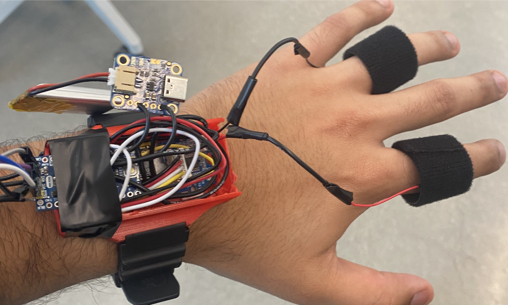
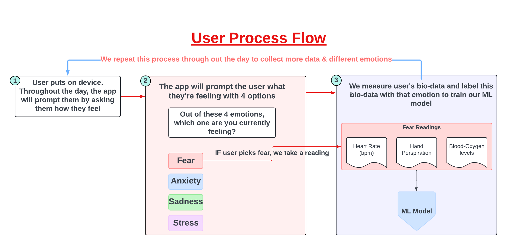
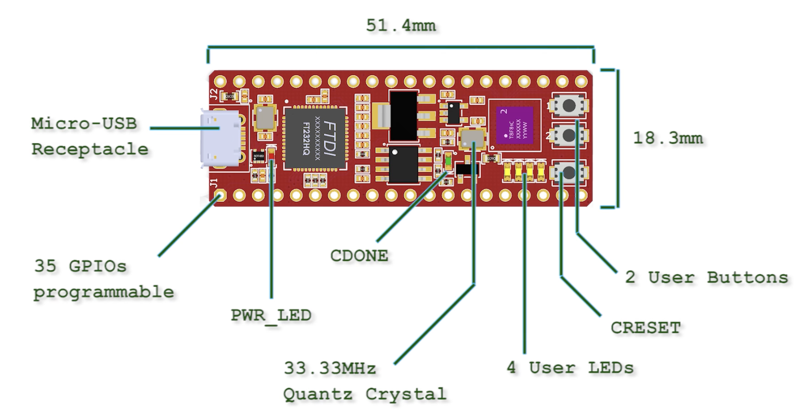
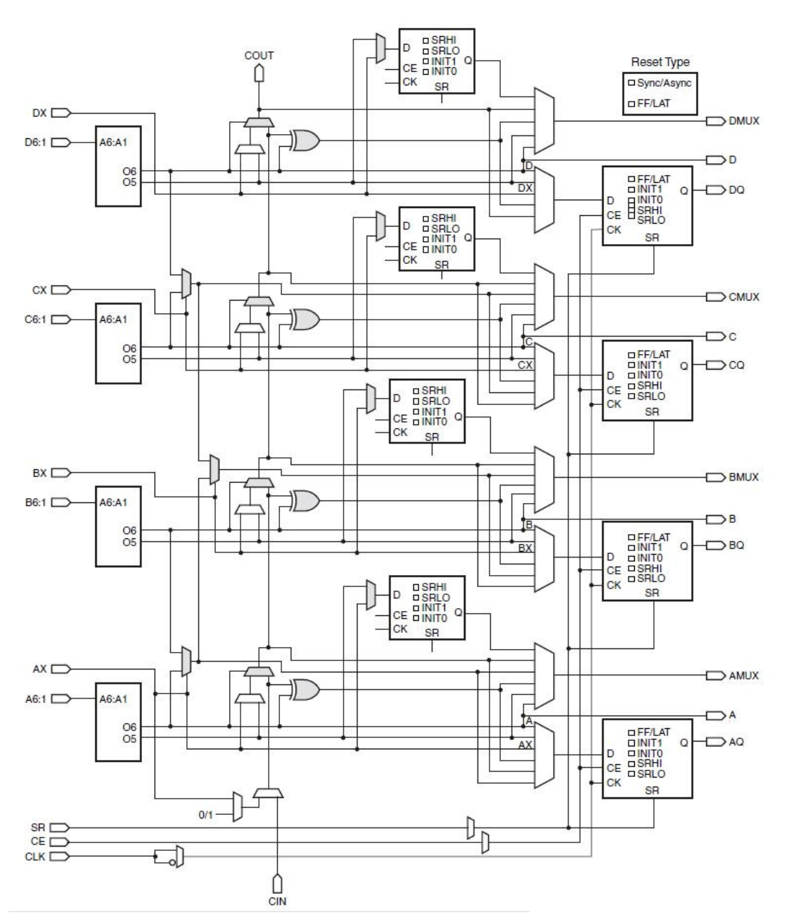
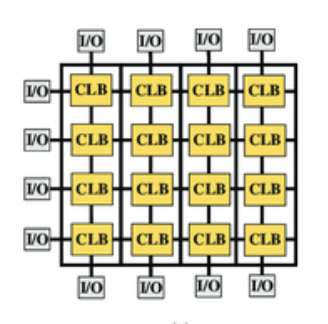
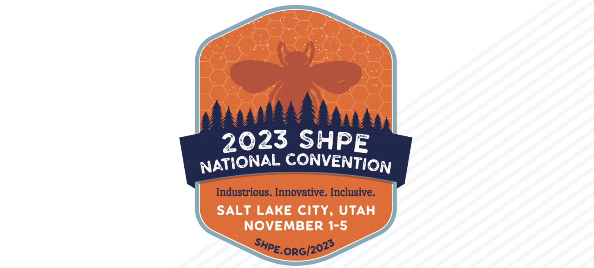

<!-- PROJECT LOGO -->

<h3 align="center">Hello, I'm Salvador Jimenez</h3>

  An enthusiastic Computer Engineer and ambitious learner sharing experiments, knowledge, and career experiences.

<!-- TABLE OF CONTENTS -->

  
Table of Contents

  <ol>
    <li><a href="#about-me">About Me</a></li>
    <li><a href="#past-intern--professional-experience">Past Intern & Professional Experience</a></li>
    <li><a href="#projects">Projects</a></li>
    <li><a href="#hackathons-ive-participated-in">Hackathons I've Participated In</a></li>
    <li><a href="#contact--linkedin">Contact & LinkedIn</a></li>
  </ol>

<!-- ABOUT ME -->
## About Me

My expertise lies at the dynamic intersection of Hardware and Software realms, where I've navigated the intricate interplay between the two. As a Computer Engineer, I've delved deep into this vibrant ecosystem, harnessing its formidable potential to craft an impressive array of projects. From frontend to backend systems, database management, embedded systems, working baremetal with FPGA's, and even transistor design...
Outside of school and work, I am very passionate about sports such as boxing, and running - no worries, I will not bother you with that here!

(<a href="#readme-top">back to top</a>)

<!-- PAST INTERN & PROFESSIONAL EXPERIENCE -->
## Past Intern & Professional Experience

### **Zensor - Personalized Meditation Device ECASP Project @ Illinois Tech**
**Team Members:** Salvador Jimenez, YoungJo Choi, Fayez Ghosein, Bhuvanesh Rajagopal  
**Instructor:** Dr. Jafar Saniie  
**Teaching Assistants:** Xinrui Yu, Mikhail Gromov  
**Course:** ECE 441 Spring 2024  

*Built With:*
* [![Arduino][Arduino-shield]][Arduino-url]
* [![Raspberry Pi][RaspberryPi-shield]][RaspberryPi-url]
* [![Firebase][Firebase-shield]][Firebase-url]
* [![Python][Python-shield]][Python-url]
* [![Android Studio][AndroidStudio-shield]][AndroidStudio-url]
* [![Machine Learning][MachineLearning-shield]][MachineLearning-url]

#### Overview

Zensor is a personalized meditation device designed to help users manage their emotional well-being. The device uses bio-data to predict the user's emotional state and provides customized meditation sessions to help users overcome negative emotions. My specific task was creating the Android Application, as well as intergating Firebase, the Raspberry pi 5 and the sensors array together for seamless communication between each part. 

####  Big Picture Technical Overview

#### Software Architecture
- **Meditation Algorithm:** Machine learning model (Decision Tree) trained on biometric data to predict emotional states. The following **Diagrams represent 1st and 2nd Stages.**
  ##### Stage 1: User is prompted multiple times throughout the day to aggregate a large amount of data for our ML model.
    

  ##### Stage 2: After we've collected a sufficient amount of data, the user can now just put on the device and the sensors will predict an emotion and return a tailored meditation practice to help them handle that emotion.
    
  
#### Live Demo Video Link:
[LOOM Video Demo](https://www.loom.com/share/299a1b1e04414c11861a4b76ba6212f2?sid=60bab68d-1b5e-46e7-a23c-9dedf14cfc5d)

#### Full GitHub Repo [Here](https://github.com/ELECTRONICA-2501/ZensorApp/blob/main/README.md)

(<a href="#readme-top">back to top</a>)

### **The Build Fellowship - WebRTC Software Engineering Fellowship (unpaid internship Summer 2024)**

#### Web App Project + Demo

The Virtual Office Web application is a web app that allows users on a 2D board to video chat with each other. This app is supposed to simulate the feeling of being at a virtual office for remote workers. This app was built using React and Node.js on the client side, while also using simple-peer API to facilitate the WebRTC connection between users. Socket.IO powers the server side, providing real-time bidirectional communication to support user movements on the gameboard.

#### This app Was Built With: 

* [![React][React.js]][React-url]
* [![Firebase][Firebase-shield]][Firebase-url]
* [![JavaScript][JavaScript-shield]][JavaScript-url]
* [![React_Redux][React_Redux-shield]][React_Redux-url]
* [![Node_js][Node_js-shield]][Node_js-url]
* [![Socket_IO][Socket_IO-shield]][Socket_IO-url]
* [![Peer_JS][Peer_JS-shield]][Peer_JS-url]

#### Loom Demo + Presentation Link 
##### Check out the following link for a presentation and demo at the end :)
 https://www.loom.com/share/c64fff055ec94d0bae7b4863a2b112a8?sid=53faedfe-4f3a-4a44-a937-2297b2a1109b

#### Architecture
##### Client side 

##### Server side

#### Full GitHub Repo [HERE](https://github.com/ELECTRONICA-2501/OA/tree/main)

### **Open Avenues FPGA Research Internship with Open Avenues (Co-Op Spring 2024)**

During my research internship co-op, I worked on a project using an Effinity-based FPGA to control the brightness of an array of LEDs. The project involved implementing two different methods to modulate LED brightness: Pulse Width Modulation (PWM) and Pulse Frequency Modulation (PFM). I focused on using the PWM approach to control the LEDs' brightness levels.

##### How an FPGA Works
Field Programmable Gate Arrays (FPGAs) are integrated circuits that can be configured by the user after manufacturing. Unlike a CPU, which executes instructions sequentially based on a pre-defined architecture, an FPGA allows for highly parallel computation. FPGAs are reprogrammable, meaning that you can design custom hardware architectures tailored to specific tasks. The logic gates and interconnects inside the FPGA can be rewired to perform different tasks, enabling custom implementations of digital circuits.

#### FPGA vs CPU:
- **Parallelism**: An FPGA is capable of true hardware-level parallelism. Multiple logic operations can occur simultaneously. On the other hand, a CPU typically performs tasks sequentially, even with multi-core architectures.
- **Flexibility**: CPUs have a fixed architecture designed for general-purpose computing, while FPGAs can be tailored for specific tasks, making them highly efficient for specialized applications like signal processing, custom controllers, etc.
- **Latency**: FPGAs offer lower latency because computations can be done in hardware, whereas CPUs often require instructions to be fetched and decoded before being executed.
  

#### Technologies Used

* [![Xilinx Vivado][Xilinx-Vivado-shield]][Xilinx-Vivado-url]
* [![Effinity FPGA][Effinity-shield]][Effinity-url]
* [![PWM][PWM-shield]][PWM-url]

#### Full GitHub Repo [Here](https://github.com/ELECTRONICA-2501/OpenAvenues_FPGA_Documentation/tree/main)

(<a href="#readme-top">back to top</a>)

<!-- PROJECTS -->
## Projects

### VLSI

### 3D printed Augmented Reality Headset
I helped spearhead the design, research, integration, testing, and troubleshooting for this project. We placed 4th out of 40 teams at the engineering hackathon...

### GradPath AI (Recommender System/Chatbot for classes)
Developed an AI-driven recommendation system to provide personalized course recommendations, improving student graduation rates...

(<a href="#readme-top">back to top</a>)

<!-- HACKATHONS -->
## Hackathons I've Participated In

### Real-Time Communications Hackathon. Sponsored by [IEEE](https://www.ieee.org/)
- The RTC Conference at IIT is a globally recognized collaborative event where the interactive multimedia and real-time communications industries and academia connect. The conference  brings together developers, technical professional and business executives from industry, standards, policy, regulatory, and research, promoting an open exchange of ideas to lead future development in the rapidly changing field of real-time communications.

 Here is a link to the description: [RTC HACK](https://events.vtools.ieee.org/m/348711)
 We placed **2nd out of 15 teams**. We helped build out a website that integrated two different companies API's: 
 LiveKit API DOC can be found [here](https://docs.livekit.io/realtime/) and InDigital [here](https://indigital.net/)
 
 End project was a tutor like service where students can connect with tutors and peers in Real Time, and also use our built in AI chatbot to ask questions regarding subject matters. LinkedIn Post about the event [here](https://www.linkedin.com/feed/update/urn:li:activity:7114670066301890560/)

 
### SHPE 2023 CyberSecurity Challenge. Sponsored by [NSA](https://www.nsa.gov/), [Raytheon](https://www.rtx.com/), [Abbott](https://www.abbott.com/), & [Rockwell Automation](https://www.rockwellautomation.com/en-us.html)
 - This hackathon was hosted by the SHPE 2023 National Convention in Salt Lake City, UTAH.
We were placed in a random team with 4 others, our goal was to solve sets of cybersecurity challenges -all worth differing amount of points depending on its difficutly. This covered topics such as SQL injections, Stack-Overflow, Systems Programming, Operational Security, Administrative Security, Digital Forensics & more. Our team place **8th out of 40** cant win em' all you know. :(. This one had some tough competition.

(<a href="#readme-top">back to top</a>)

<!-- CONTACT & LINKEDIN -->
## Contact & LinkedIn

Feel free to reach out to me at <sal.hndrx@gmail.com>  
You can find my LinkedIn [Here](https://www.linkedin.com/in/sjimenez2501/)

If you made it this far... check this out... [trust me :) ?](https://matias.ma/nsfw/) 

(<a href="#readme-top">back to top</a>)

<!-- MARKDOWN LINKS & IMAGES -->
[React.js]: https://img.shields.io/badge/React-20232A?style=for-the-badge&logo=react&logoColor=61DAFB
[React-url]: https://reactjs.org/
[JavaScript-shield]: https://img.shields.io/badge/javascript-%23323330.svg?style=for-the-badge&logo=javascript&logoColor=%23F7DF1E
[JavaScript-url]: https://www.javascript.com/
[React_Redux-shield]: https://img.shields.io/badge/redux-%23593d88.svg?style=for-the-badge&logo=redux&logoColor=white
[React_Redux-url]: https://react-redux.js.org/
[Firebase-shield]: https://img.shields.io/badge/firebase-a08021?style=for-the-badge&logo=firebase&logoColor=ffcd34
[Firebase-url]: https://firebase.google.com/
[Node_js-shield]: https://img.shields.io/badge/node.js-6DA55F?style=for-the-badge&logo=node.js&logoColor=white
[Node_js-url]: https://nodejs.org/
[Socket_IO-shield]: https://img.shields.io/badge/Socket.io-black?style=for-the-badge&logo=socket.io&badgeColor=010101
[Socket_IO-url]: https://socket.io/
[Peer_JS-shield]: https://img.shields.io/badge/peerjs-black?style=for-the-badge&logo=peerjs&badgeColor=010101
[Peer_JS-url]: https://peerjs.com/
[Arduino-shield]: https://img.shields.io/badge/Arduino-00979D?style=for-the-badge&logo=arduino&logoColor=white
[Arduino-url]: https://www.arduino.cc/

[RaspberryPi-shield]: https://img.shields.io/badge/Raspberry%20Pi-A22846?style=for-the-badge&logo=raspberry-pi&logoColor=white
[RaspberryPi-url]: https://www.raspberrypi.org/

[Firebase-shield]: https://img.shields.io/badge/firebase-a08021?style=for-the-badge&logo=firebase&logoColor=ffcd34
[Firebase-url]: https://firebase.google.com/

[Python-shield]: https://img.shields.io/badge/Python-3776AB?style=for-the-badge&logo=python&logoColor=white
[Python-url]: https://www.python.org/

[AndroidStudio-shield]: https://img.shields.io/badge/Android%20Studio-3DDC84?style=for-the-badge&logo=android-studio&logoColor=white
[AndroidStudio-url]: https://developer.android.com/studio

[MachineLearning-shield]: https://img.shields.io/badge/Machine%20Learning-FF6F00?style=for-the-badge&logo=ml&logoColor=white
[MachineLearning-url]: https://scikit-learn.org/

[Bluetooth-shield]: https://img.shields.io/badge/Bluetooth-0082FC?style=for-the-badge&logo=bluetooth&logoColor=white
[Bluetooth-url]: https://www.bluetooth.com/badge&logo=ml&logoColor=white
[MachineLearning-url]: https://scikit-learn.org/

[Xilinx-Vivado-shield]: https://img.shields.io/badge/Xilinx_Vivado-F75C03?style=for-the-badge&logo=xilinx&logoColor=white
[Xilinx-Vivado-url]: https://www.xilinx.com/products/design-tools/vivado.html

[VHDL-shield]: https://img.shields.io/badge/VHDL-4B0082?style=for-the-badge
[VHDL-url]: https://en.wikipedia.org/wiki/VHDL

[Effinity-shield]: https://img.shields.io/badge/effinity-FPGA-green?style=for-the-badge
[Effinity-url]: https://www.effinity.com/

[PWM-shield]: https://img.shields.io/badge/PWM-FFA500?style=for-the-badge
[PWM-url]: https://en.wikipedia.org/wiki/Pulse-width_modulation

